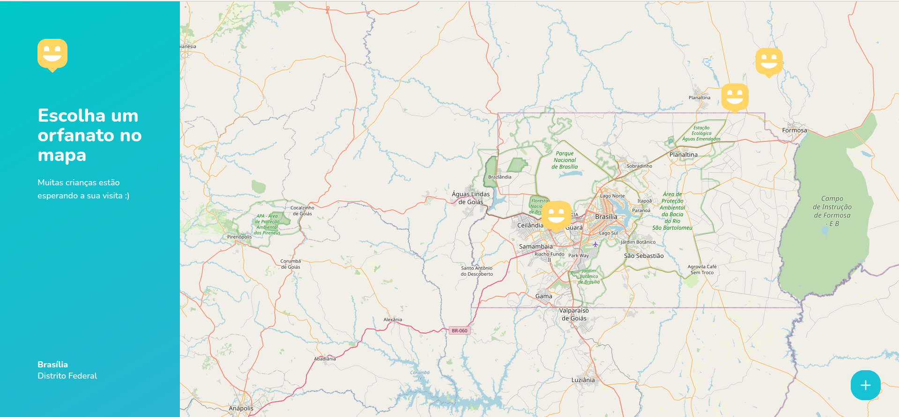
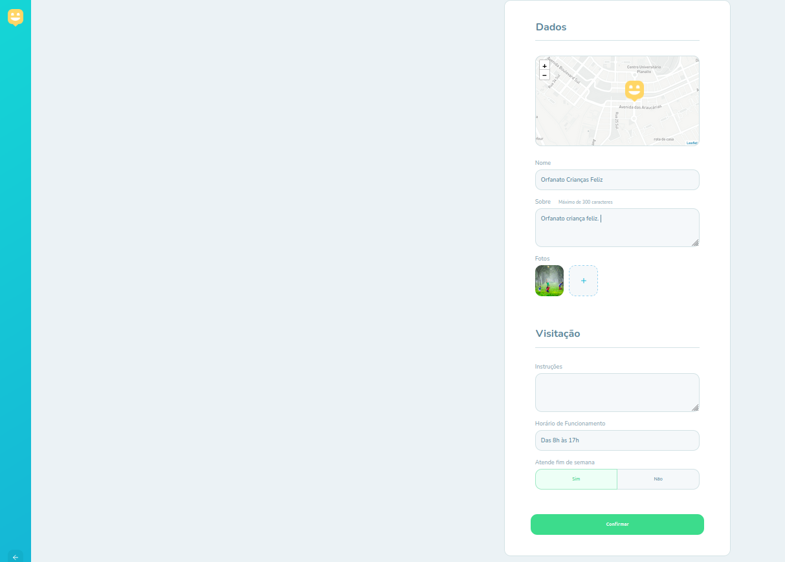

<h1 align="center">
    
</h1>

   

   

   

---

# :pushpin: Table of Contents

- [About](#information_source-about)
- [Features](#rocket-features)
- [Technologies](#star-technologies)
- [Installation](#construction_worker-installation)
- [Getting Started](#runner-getting-started)
- [FAQ](#postbox-faq)
- [License](#closed_book-license)

 

# :information_source: About

This project was created in the NLW (Next Level Week) #3 promoted by [Rocketseat](https://rocketseat.com.br/).
The project consists in connecting users to orphanages near by their location.
The App contais 4 pages:

- Home
- OrphanagesMap (List of Orphanages in a Map)
- Orphanage (specific Orphanage selected)
- Create Orphanage

# :rocket: Features

- #### Home Landing Page.
- #### A list of created Orphanages pinned in a map
- #### Creating new orphanages
- #### View specific orphanage
- #### Upload Photos

# :star: Technologies

| Frontend                                                  | Backend                                                                    | Mobile                                   |
| --------------------------------------------------------- | -------------------------------------------------------------------------- | ---------------------------------------- |
| [React](https://reactjs.org/)                             | [express](https://expressjs.com/pt-br/)                                    | [expo](https://expo.io/)                 |
| [styled-components](https://styled-components.com/)       | [express-async-errors](https://www.npmjs.com/package/express-async-errors) | [react native](https://reactnative.dev/) |
| [react-icons](https://react-icons.github.io/react-icons/) | [multer](https://www.npmjs.com/package/multer)                             |                                          |
| [leaflet](https://leafletjs.com/)                         | [sqlite3](https://www.sqlite.org/index.html)                               |                                          |
| [react-leaflet](https://react-leaflet.js.org/)            | [bcryptjs](https://www.npmjs.com/package/bcryptjs)                         |                                          |
| [axios](https://github.com/axios/axios)                   | [cors](https://www.npmjs.com/package/co)                                   |                                          |
| [Mapbox](https://mapbox.com)                              | [nodemon](https://nodemon.io/)                                             |
|                                                           | [typeorm](https://typeorm.io/#/)                                           |
|                                                           | [yup](https://github.com/jquense/yup)                                      |

# :construction_worker: Installation

**You need to install [Node.js](https://nodejs.org/en/download/) and [Yarn](https://yarnpkg.com/) first, then in order to clone the project via HTTPS, run this command:**

`git clone https://github.com/jonatasoc/nlw03_happy_web.git`

SSH URLs provide access to a Git repository via SSH, a secure protocol. If you have a SSH key registered in your Github account, clone the project using this command:

`git@github.com:jonatasoc/nlw03_happy_web.git`

**Install dependencies**

`yarn`

# :runner: Getting Started

After that, run the following command in order to start the application in a development environment:

`yarn start`

# :closed_book: License

Released in 2020 (Work in progress)
This project is under the MIT license
